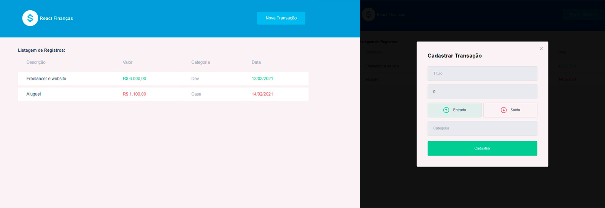

<h2  align="center">

</h2>

  
<p  align="center">
<a  href="#-projeto">Projeto</a>&nbsp;&nbsp;&nbsp;|&nbsp;&nbsp;&nbsp;
<a  href="#-tecnologias">Tecnologias</a>&nbsp;&nbsp;&nbsp;|&nbsp;&nbsp;&nbsp;
<a  href="#-scripts">Scripts</a>&nbsp;&nbsp;&nbsp;|&nbsp;&nbsp;&nbsp;
<a  href="#-orientações">Orientações</a>&nbsp;&nbsp;&nbsp;|&nbsp;&nbsp;&nbsp;
<a  href="#-licença">Licença</a>
</p>

  

## 💻 Projeto
  

Este projeto é uma aplicação ReactJS desafio para listagem de dados em endpoint, formatacao e contextos;
Inspirado em um projeto das trilhas da [Rocketseat](https://www.rocketseat.com.br/).
  

## 🧪 Tecnologias


O projeto foi desenvolvido usando as seguintes tecnologias:

  

- [React](https://reactjs.org)

- [Styled-Components](https://styled-components.com)

- [Axios](https://axios-http.com)

- [MirageJS](https://miragejs.com)


  

## 📝 Scripts
Instale as dependências.

```bash

$ yarn

```

  
Para executar o projeto rode o comando abaixo.

```bash

$ yarn start 

```

## 📝 Orientações

O projeto possui integrado o mirageJS, então ao startar o mesmo, estará disponível os endpoints para utilização.

##### Listagem de Transações
```js

GET: {{baseurl}}/api/transactions

```

##### Salvar transação
```js

POST: {{baseurl}}/api/transactions
body:{
    title: string,
    amount: number,
    category: string
    type: string
}

```
## #Desafios a serem feitos

##### #01 Home ‘./src/pages/home’ 
Implementar ações de mostrar e ocultar modal
    

##### #02 Contexto ‘.src/contexts/useTransactions’
Implementar captação de listagem dos registros e salvar no estado do contexto, utilizar requisição na api (mockup api do  miragejs), conforme endpoint acima, pasta './src/services' ja possui o agente para requisição.
    

##### #03 Modal ‘./src/components/NewTransactionModal’
Implementar ação do submit do formulário para cadastrar a operação, fechar modal após submit
    

##### #04 Contexto ‘.src/contexts/useTransactions’
Implementar a criação da transação vinda do submit do form no modal, utilizar requisicao na api (mockup api do  miragejs), conforme endpoint acima, pasta './src/services' já possui o agente para requisição.
    

##### #05 Componente de listagem ‘./src/components/ListRegisters’ 
Formatar valor e data, colocar coluna de valor e data nas cores verde ou vermelhor conforme tipo de operação, observar a classe do <td/> e ajustar no css.
    

    

## 📝 Licença 
 

This project is licensed under the MIT License. See the [LICENSE](LICENSE.md) file for details.

  ---


<p  align="center">Made with 💜 by <a  href="https://github.com/hog099"  target="_blank">Hudson Oliveira</a></p>